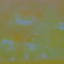

# **Vehicle Detection Project**

[Exported Jupyter notebook](https://jefflirion.github.io/udacity_car_nanodegree_project05/Vehicle_Detection.html)

[Project Documentation](https://jefflirion.github.io/udacity_car_nanodegree_project05/docs/index.html)

---

## From Udacity:

> The goals / steps of this project are the following:
>
> * Perform a Histogram of Oriented Gradients (HOG) feature extraction on a labeled training set of images and train a classifier Linear SVM classifier
> * Optionally, you can also apply a color transform and append binned color features, as well as histograms of color, to your HOG feature vector.
> * Note: for those first two steps don't forget to normalize your features and randomize a selection for training and testing.
> * Implement a sliding-window technique and use your trained classifier to search for vehicles in images.
> * Run your pipeline on a video stream (start with the test_video.mp4 and later implement on full project_video.mp4) and create a heat map of recurring detections frame by frame to reject outliers and follow detected vehicles.
> * Estimate a bounding box for vehicles detected.
>
> ## Rubric points
>
> Here I will consider the [rubric points](https://review.udacity.com/#!/rubrics/513/view) individually and describe how I addressed each point in my implementation.  


### Writeup / README

#### 1. Provide a Writeup / README that includes all the rubric points and how you addressed each one.  You can submit your writeup as markdown or pdf.  [Here](https://github.com/udacity/CarND-Vehicle-Detection/blob/master/writeup_template.md) is a template writeup for this project you can use as a guide and a starting point.  

You're reading it!


### Histogram of Oriented Gradients (HOG)

I implemented a [`Frame`](https://jefflirion.github.io/udacity_car_nanodegree_project05/docs/project05.frame.html) class which contains all of the necessary methods for extracting features and detecting cars in an image/video frame.  


#### 1. Explain how (and identify where in your code) you extracted HOG features from the training images.

This step is performed by the method [`Frame.get_hog_features()`](https://jefflirion.github.io/udacity_car_nanodegree_project05/docs/project05.frame.html#project05.frame.Frame.get_hog_features).  I used the `YCrCb` color channels (all 3), as these yielded better results in my experiments.  The parameters used for feature extraction can be found in the cell [Parameters used for feature extraction and training the classifier](https://jefflirion.github.io/udacity_car_nanodegree_project05/Vehicle_Detection.html#Parameters-used-for-feature-extraction) of my Jupyter notebook:

```
HOG parameters
--------------
Colorspace for HOG features:  YCrCb
Number of orientations:  9
Pixels per cell:  (8, 8)
Cells per block:  (2, 2)
Cells per step:  2
Block normalization method:  L1
HOG channel(s) used:  ALL
```

The relevant code in the Jupyter notebook is:

* [1. Feature extraction](https://jefflirion.github.io/udacity_car_nanodegree_project05/Vehicle_Detection.html#1.-Feature-extraction)
  * [Get lists of image paths](https://jefflirion.github.io/udacity_car_nanodegree_project05/Vehicle_Detection.html#Get-lists-of-image-paths)
  * [Load the `cars` and `notcars` images](https://jefflirion.github.io/udacity_car_nanodegree_project05/Vehicle_Detection.html#Load-the-cars-and-notcars-images)
  * [Extract features from `cars` and `notcars`](https://jefflirion.github.io/udacity_car_nanodegree_project05/Vehicle_Detection.html#Extract-features-from-cars-and-notcars)

An example of a car and "not car" image can be seen in the next section.  


#### 2. Explain how you settled on your final choice of HOG parameters.

I explored the data in the cell [2. Data exploration](https://jefflirion.github.io/udacity_car_nanodegree_project05/Vehicle_Detection.html#2.-Data-exploration) of my Jupyter notebook.  I initially used the `RGB` channels for my HOG, color binning, and color histogram feature extractions, but found that the `YCrCb` channels worked better.  Based on the images below and other images I saw in my data exploration, I believe this is due in part to the fact that the `YCrCb` channels tend to differentiate between shiny and reflective cars versus dull non-car objects.  For HOG, I used 9 orientations, 8x8 cells, and 2x2 cells per block; all of those were the standard parameters used through the lessons.  My classifier was achieving over 99% accuracy, so I felt that this was sufficient.  Ultimately, I found that it was pretty easy to do well on the training and testing data, but much more difficult to do a satisfactory job on the larger images and video data.

Here are some sample images and extracted features:


<br>

<br>




#### 3. Describe how (and identify where in your code) you trained a classifier using your selected HOG features (and color features if you used them).

In cell [Linear SVM with `C = 1`](https://jefflirion.github.io/udacity_car_nanodegree_project05/Vehicle_Detection.html#Linear-SVM-with-C-=-1) of my Jupyter notebook, I trained a linear SVM with `C = 1`.  I tried using `GridSearchCV` to train the model in cell [Use `GridSearchCV`](https://jefflirion.github.io/udacity_car_nanodegree_project05/Vehicle_Detection.html#Use-GridSearchCV), but I found that this selected `C = 1` anyways.  I used HOG features, binned color features, and color histogram features.  


### Sliding Window Search

#### 1. Describe how (and identify where in your code) you implemented a sliding window search.  How did you decide what scales to search and how much to overlap windows?

I implemented a sliding approach following what was presented in the lessons.  One improvement that I made was to extend the window to the full width of the image.  This is done in the method [`Frame.get_windows()`](https://jefflirion.github.io/udacity_car_nanodegree_project05/docs/project05.frame.html#project05.frame.Frame.get_windows).  The parameters that I used are contained in the cell [Parameters used for detecting cars in an image](https://jefflirion.github.io/udacity_car_nanodegree_project05/Vehicle_Detection.html#Parameters-used-for-detecting-cars-in-an-image).  These were found through a lot of trial and error.  I used scales 1.5 and 2 (i.e., square windows with side lengths 96 and 128, respectively).  I used an overlap of 1 cell because I found that using 2 cells led to missed cars.  I also found that using smaller scales led to false positives.  Here are displays of the windows that I searched:


#### 2. Show some examples of test images to demonstrate how your pipeline is working.  What did you do to optimize the performance of your classifier?

I used the `YCrCb` channels (all 3 of them), and I used HOG, color binning, and color histogram features.  I played around with the area within the image that was searched (`min_rows` and `max_rows`), as well as the `cells_per_steps` and `scales` parameters; see the method [`Frame.get_bboxes()`](https://jefflirion.github.io/udacity_car_nanodegree_project05/docs/project05.frame.html#project05.frame.Frame.get_bboxes).  Here are some examples:


### Video Implementation

#### 1. Provide a link to your final video output.  Your pipeline should perform reasonably well on the entire project video (somewhat wobbly or unstable bounding boxes are ok as long as you are identifying the vehicles most of the time with minimal false positives.)

Here's a [link to my video result](./project_video_cars.mp4)


#### 2. Describe how (and identify where in your code) you implemented some kind of filter for false positives and some method for combining overlapping bounding boxes.

The method [`Frame.find_cars`](https://jefflirion.github.io/udacity_car_nanodegree_project05/docs/project05.frame.html#project05.frame.Frame.find_cars) removes false positive and smooths the bouding boxes from frame to frame in the video.  When information about previous vehicles is provided, this function does two main things:

1. Combine the heatmaps, adding up the current `Frame`'s heatmap and the heatmaps from the provided previous `Frame`s and then taking the average.  This heatmap is then thresholded using `heat_thresh = 2`.  The aim of this step was to remove false positives and also to recover missed detections.  
2. I created a new heatmap using the bounding boxes for the car detections from the current `Frame` and from the provided previous `Frame`s, and I drew bounding boxes using the labels obtained by  applying `scipy.ndimage.measurements.label` to this new heatmap.  The aim of this step was to help smooth the bounding boxes from frame to frame.  

I ran [`Frame.find_cars`](https://jefflirion.github.io/udacity_car_nanodegree_project05/docs/project05.frame.html#project05.frame.Frame.find_cars) on the project video, supplying each `Frame` with the previous 5 `Frame`s, including their car detections and heatmaps.  


### Discussion

#### 1. Briefly discuss any problems / issues you faced in your implementation of this project.  Where will your pipeline likely fail?  What could you do to make it more robust?

Here I'll talk about the approach I took, what techniques I used, what worked and why, where the pipeline might fail and how I might improve it if I were going to pursue this project further.  

There were essentially 3 aspects to this project:

1. **The 64x64 classifier.**  I used an SVM classifier, and it achieved over 99% accuracy on my validation dataset.  As we were provided with training data, this part of the project was pretty simple and I did not consider it to be the most important aspect for getting good results on the video.  
2. **The sliding window search.**  This required some parameter tuning.  Although my SVM classifier was very accurate, my sliding window search missed some cars because they weren't captured by windows of appropriate size and location.  Also, searching nonsensical areas like the sky would lead to false positives.  
3. **Post-processing the detections.**  For me, this was the most difficult aspect of the project.  After a lot of fine tuning, my sliding window search algorithm became very good at finding cars within images, as the results above demonstrate.  However, my car bounding boxes were very jittery.  It took a lot of trial and error to post-process the detections in such a way that the bounding boxes were (somewhat) smooth without introducing false positives or causing missed detections.  

This pipeline would fail if there was a shiny metallic object, such as a road or construction sign, in one of its search windows.  It would also struggle when the steepness of the road changes, since the windows may no longer be the appropriate size to capture vehicles.  

This pipeline would fail in a real-time scenario!  It takes about a second to process each image.  

One approach that could help to speed up the pipeline and yield better results would be to only perform a sliding window search on the regions of the image where cars enter/leave the field of view; that is, the sides and the horizon.  Once a car enters the field of view and is detected, it could then be tracked using template matching from each frame to the next.  And since the car's position won't change much from frame to frame, only a small portion of the image would need to be searched for a template match.  

A completely different approach that I think would perform well would be to use deep learning, since 2D and 3D convolutions should be ideally suited for such a task.  
